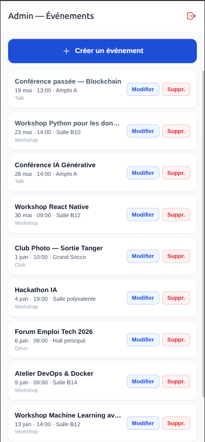
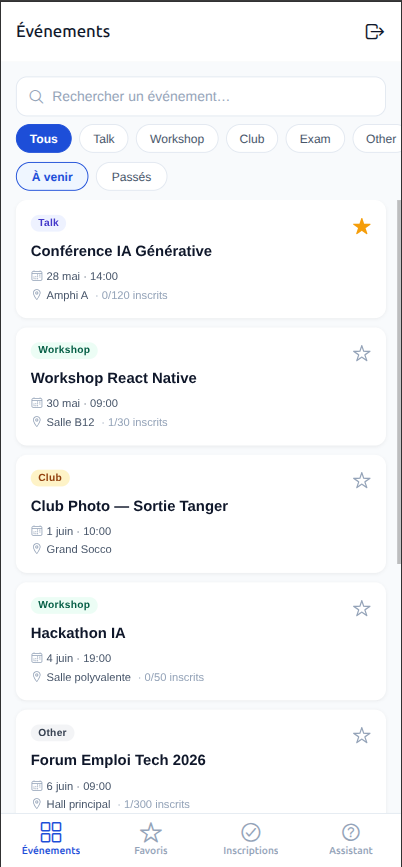
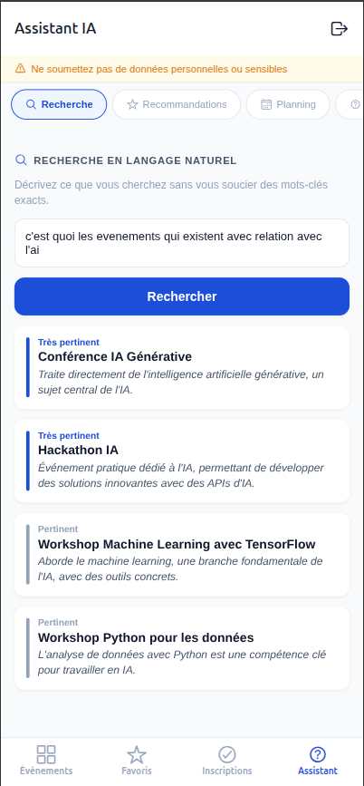
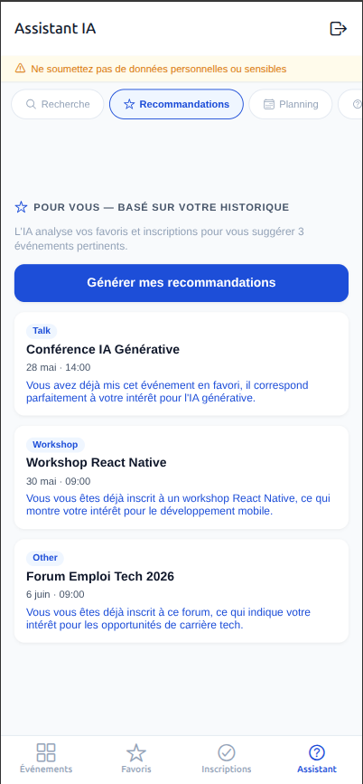
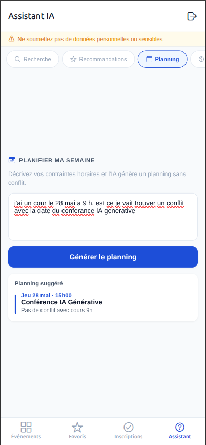
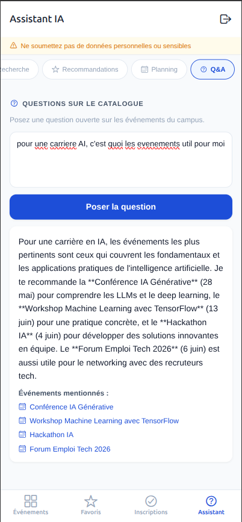

# CampusEvents AI 🎓🤖

Une application mobile multiplateforme développée avec React Native et Expo pour centraliser les événements universitaires et guider les étudiants de manière ultra-personnalisée grâce à l'Intelligence Artificielle.

## 📌 Le Problème & La Solution
Les événements universitaires (workshops, conférences, réunions de clubs) sont souvent dispersés et manquent de visibilité. De plus, il est difficile pour un étudiant de filtrer ce qui est réellement pertinent pour lui parmi une mer d'informations.

**CampusEvents AI** résout ce problème en combinant un catalogue structuré (géré par l'administration) et un **Assistant IA** (LLM) capable de raisonner sur les données du catalogue pour offrir des recommandations, planifier des semaines, et répondre aux requêtes en langage naturel.

---

## ✨ Fonctionnalités Principales

L'application gère deux rôles distincts (avec navigation et UI adaptées) :

### 🛡️ Rôle Administrateur (`admin@campus.ma`)
- **Gestion Complète du Catalogue** : Interface dédiée pour créer, modifier et supprimer des événements.
- **Validations Intégrées** : Contrôle automatique de la cohérence des dates, des capacités et des champs requis.
- **Cascade Delete** : La suppression d'un événement supprime automatiquement les inscriptions et favoris associés dans la base de données.

### 🎓 Rôle Étudiant (`etudiant@campus.ma`)
- **Catalogue Intelligent** : Exploration des événements passés et à venir, recherche exacte et filtrage rapide par catégorie (Talk, Workshop, Club, Exam, etc.).
- **Favoris & Inscriptions** : Gestion des participations (empêchant les doublons ou inscriptions sur des événements passés/complets) et sauvegarde des favoris.
- **Assistant IA (Le Cœur du Projet)** : 4 fonctionnalités exclusives propulsées par l'Intelligence Artificielle.

---

## 🧠 L'Assistant IA (LLM)

L'assistant IA communique de manière asynchrone avec une API (par défaut DeepSeek). Afin de garantir d'excellentes performances et limiter la facturation API, tous les résultats sont **mis en cache localement dans SQLite** (table `llm_results`). L'assistant comporte 4 modules :

### 1. 🔍 Recherche en Langage Naturel
*Exemple : "Un événement pour préparer ma recherche de stage."*
L'IA raisonne sur la sémantique et trouve des événements pertinents même sans correspondances exactes de mots-clés (contrairement à une simple barre de recherche). Chaque résultat est justifié par l'IA.

### 2. ⭐ Recommandations Personnalisées
L'IA analyse le profil de l'étudiant à partir de son historique (événements favoris et inscriptions) et suggère proactivement 3 événements à venir qui lui correspondent parfaitement, avec une explication claire.

### 3. 📅 Assistant de Planification
*Exemple : "J'ai cours lundi et mercredi, aide-moi à planifier ma semaine."*
L'étudiant décrit ses contraintes horaires, et le LLM propose un emploi du temps optimisé et cohérent sur la semaine, sans aucun conflit avec les événements du campus.

### 4. 💬 Questions Globales (Q&A)
*Exemple : "Quels événements sont utiles pour une carrière en Data Science ?"*
Le modèle scanne la totalité du catalogue pour formuler une réponse naturelle, tout en listant et associant les événements précis liés à la réponse.

---

## 🛠️ Architecture Technique & Choix

- **Frontend** : **React Native / Expo Router** pour une navigation structurée et fluide basée sur les fichiers (Stack et Tabs).
- **Persistance Locale** : **`expo-sqlite`**. Tout le stockage (utilisateurs, événements, favoris, cache IA) est fait hors-ligne via des tables relationnelles. (Note : les profils se partagent la même base de données locale dans le cadre de cette démo).
- **Modèles de Données (Tables)** : `events`, `registrations`, `favorites`, `llm_results`.
- **Intégration IA** : Implémentation via l'API HTTP native (`services/llm.ts`). Tous les prompts sont fortement structurés avec un rôle système strict, une injection des données formatées et des requêtes JSON pures (`{"eventId": "..."}`).
- **Gestion des Sessions** : **AsyncStorage** combiné à un `AuthContext` permettant une persistance totale lors des redémarrages.

---

## 🚀 Installation & Lancement

### 1. Cloner le repository
\`\`\`bash
git clone <votre_url_github>
cd smart-event
\`\`\`

### 2. Installer les dépendances
\`\`\`bash
npm install
\`\`\`

### 3. Configurer la clé API
Créez un fichier `.env` à la racine du projet et ajoutez votre propre clé API DeepSeek (ou adaptez le fichier `llm.ts` pour un autre fournisseur LLM) :
\`\`\`env
EXPO_PUBLIC_DEEPSEEK_API_KEY=votre_cle_api_ici
\`\`\`

### 4. Lancer l'application
\`\`\`bash
npm start
\`\`\`
*Une fois le bundler Metro démarré, appuyez sur `w` pour lancer sur votre navigateur Web, `a` pour Android, ou `i` pour l'émulateur iOS.*

---

## 🧪 Données de Démonstration

Au tout premier lancement de l'application, les tables SQLite sont générées automatiquement. Un jeu de données **"Démo"** d'une dizaine d'événements est injecté dans le catalogue pour vous permettre de tester immédiatement les fonctionnalités.

Comptes préconfigurés :
- **Compte Administrateur** : `admin@campus.ma` / Mot de passe : `admin123`
- **Compte Étudiant** : `etudiant@campus.ma` / Mot de passe : `etudiant123`

---

*Développé dans le cadre du Mini-projet React Native — CampusEvents AI.*
